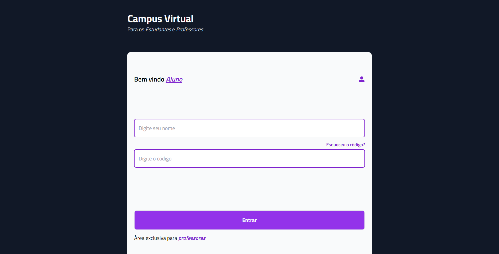
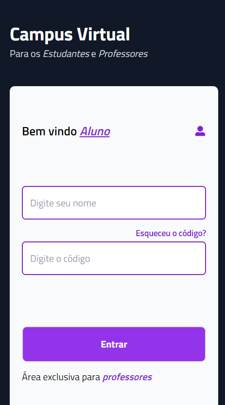

# Campus Virtual

Campus Virtual de uma escola


## Preview






## Pré-requisitos

- Use o [NODE](https://nodejs.org/en/download/) para executar código JavaScript fora do navegador web.  
- Recomendo utilizar o [VSCODE](https://code.visualstudio.com) como editro de texto.


### Inicializando

1. Digite git clone e cole a URL já copiada.

```bash
git clone https://github.com/MarshFfeco/ProjectCeep
```

2. Pressione **ENTER** para criar seu clone local.

```bash
git clone https://github.com/MarshFfeco/ProjectCeep
> Cloning into `ProjectCeep`...
> remote: Counting objects: 10, done.
> remote: Compressing objects: 100% (8/8), done.
> remove: Total 10 (delta 1), reused 10 (delta 1)
> Unpacking objects: 100% (10/10), done.
```

3. Para executar o projeto faça os comandos a seguir.

```bash
# IMPORTANDO A PASTA NODE_MODULE
npm i
```

```bash
# EXECUTAR
npm run dev
```

## CONTRIBUINDO PARA O PROJETO

1. Crie uma Branch

```bash
git checkout -b <nome_branch>
```

2. Adicione arquivos novos ou alterados em seu diretório de trabalho à área de teste do Git.

```bash
git add .
```

3. Commit o projeto.

```bash
git commit -m '<mensagem_commit>'
```

4. Selecione a branch que acabou de criar.

```bash
git branch -M <nome_branch>
```

4. Agora é so enviar.
```bash
git push 
```

## Tecnologias
- NODE
- VUEJS
- PINIA
- AXIOS
- VUE-ROUTER
- SCSS
- TAILWIND

## Equipe
<pre>
  Anderson - Desenvolvedor
  ଲ( ⓛ ω ⓛ *)ଲ
</pre>

## Versão
- 1.0.0
